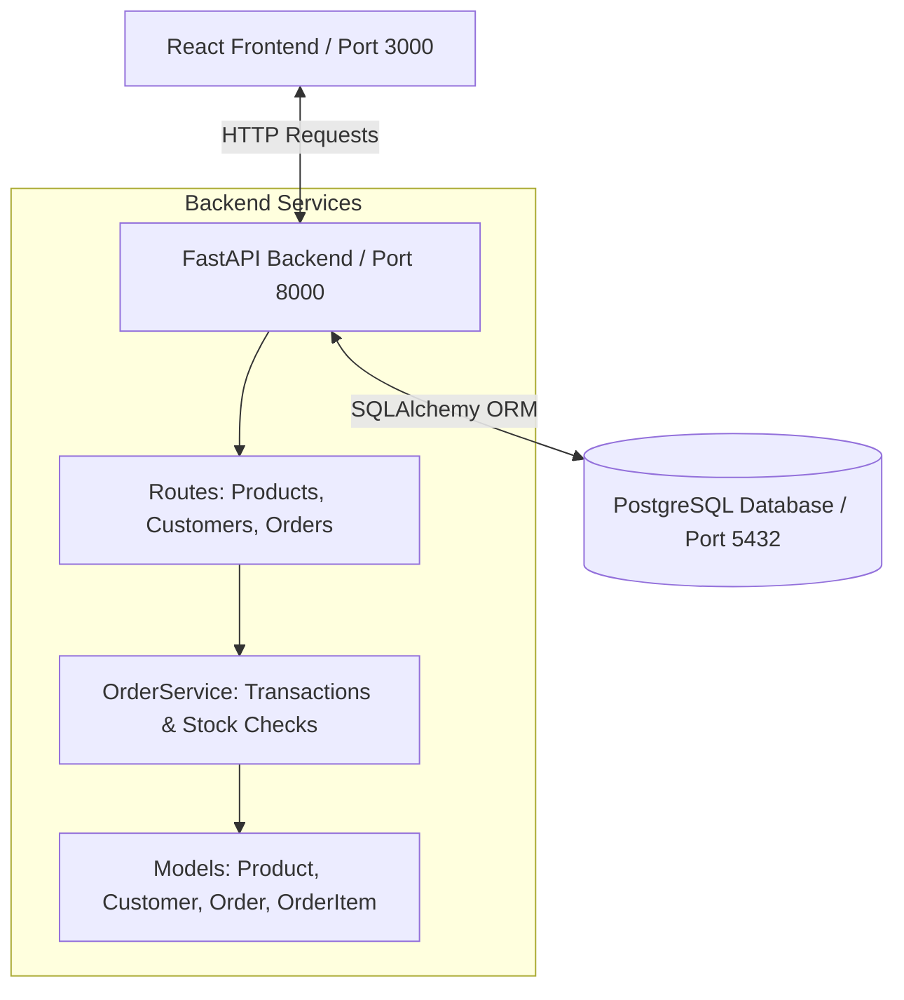

# StockWise 📦 | Modern SaaS Inventory & Order Management System

[](https://fastapi.tiangolo.com)
[](https://react.dev)
[](https://www.postgresql.org)
[](https://www.docker.com)
[](https://tailwindcss.com)

StockWise is a production-grade, containerized **Inventory & Order Management System** featuring a high-performance **FastAPI** backend, a stunning **glassmorphic React dashboard**, and a robust **PostgreSQL** database. 

It is engineered with database transaction locks to guarantee inventory integrity under high-concurrency order requests, features cascade delete protection, and automatically restores inventory items when customer profiles are deleted or order checkouts are cancelled.

---

## ✨ Features

* **SaaS Analytics Dashboard**: Real-time metrics including total revenue, active product counts, low stock alerts, stock distribution visualizations (using Recharts), and dynamic top-selling items lists.
* **Inventory Management**: Add, search, filter, and edit product catalogs with unique SKU verification and auto-updating stock badges.
* **Customer Directory**: Track client registrations, phone details, emails, and order timelines.
* **Dynamic Order Builder**: Formulate purchase invoices dynamically by selecting clients and assembling multiple line-items with live stock-limit validations and price calculations.
* **Concurreny & Race-Condition Safe**: Backend checkout uses PostgreSQL row-level locks (`SELECT ... FOR UPDATE`) to prevent double-allocation/negative stock under concurrency.
* **Inventory Restoration**: Cancelling orders or removing client profiles automatically returns allocated items to inventory.
* **Premium UX Aesthetics**: High-end dark glassmorphism layout containing custom `<ConfirmModal>` safety dialogues, animated transitions (via Framer Motion), and instant notifications/toasts.

---

## 🛠️ Technology Stack

| Layer | Technology | Details |
| :--- | :--- | :--- |
| **Frontend** | React (Vite) | Client framework for modular rendering & fast HMR. |
| **Styling** | Tailwind CSS | Utility-first styling for glassmorphic dark layouts. |
| **Charts & Animation**| Recharts & Framer Motion | Dynamic visual charts & micro-animations. |
| **Icons & Alerts** | Lucide Icons & Context Portal | Premium SVG glyphs and responsive slide-out notifications. |
| **Backend** | FastAPI (Python 3.11) | High-performance ASGI framework with Pydantic V2 validation. |
| **ORM & DB Connection**| SQLAlchemy | Declarative database mapping with dependency injection. |
| **Database** | PostgreSQL 15 | Relational engine enforcing unique, indexed fields. |
| **Orchestration** | Docker & Docker Compose | Containerized system with healthcheck-guarded dependencies. |

---

## 📐 Architecture Overview

StockWise adheres to a clean, decoupled architecture:



### Key Architectural Safeguards:
1. **Transactional Integrity**: Order placement is wrapped inside a database transaction block. If any step fails (e.g. stock exhaustion or database disconnection), the entire checkout is aborted (`ROLLBACK`).
2. **Concurrency Safety**: The `OrderService` locks product records during order execution:
   ```python
   product = db.query(Product).with_for_update().filter(Product.id == item.product_id).first()
   ```
   This stops parallel checkout requests from causing race conditions.
3. **Database Cascades**: Deleting a customer cascades and deletes all their orders (`ON DELETE CASCADE`), while restoring the corresponding item counts back to stock in the product table.

---

## 📂 Folder Structure

```text
PROJECT (Inventory Management System)/
├── backend/
│   ├── app/
│   │   ├── config/
│   │   │   └── settings.py         # Pydantic environment configurations
│   │   ├── models/
│   │   │   ├── base.py             # SQLAlchemy Declarative base class
│   │   │   ├── product.py          # Product inventory model
│   │   │   ├── customer.py         # Customer metadata model
│   │   │   └── order.py            # Order and OrderItem models
│   │   ├── schemas/
│   │   │   ├── product.py          # Pydantic Product validator schemas
│   │   │   ├── customer.py         # Pydantic Customer validator schemas
│   │   │   └── order.py            # Pydantic Order validator schemas
│   │   ├── routes/
│   │   │   ├── products.py         # Product CRUD endpoints
│   │   │   ├── customers.py        # Customer CRUD endpoints
│   │   │   ├── orders.py           # Order CRUD endpoints
│   │   │   └── dashboard.py        # Dashboard stats aggregation
│   │   ├── services/
│   │   │   └── order_service.py    # Transactional order checkout logic
│   │   ├── utils/
│   │   │   └── exceptions.py       # Custom API exception mapping handlers
│   │   ├── database.py             # DB engine connection & session builder
│   │   └── main.py                 # FastAPI Application bootstrap & middlewares
│   ├── requirements.txt            # Python backend dependencies
│   └── Dockerfile                  # Multi-stage/Optimized Python runtime setup
├── frontend/
│   ├── src/
│   │   ├── components/
│   │   │   ├── ConfirmModal.jsx    # Reusable glassmorphic confirmation modal
│   │   │   ├── DashboardCard.jsx   # Metrics KPI display card
│   │   │   ├── Modal.jsx           # Reusable generic pop-up wrapper
│   │   │   └── Spinner.jsx         # Loading feedback component
│   │   ├── pages/
│   │   │   ├── Dashboard.jsx       # Analytics widgets page
│   │   │   ├── Products.jsx        # Catalog inventory listing
│   │   │   ├── Customers.jsx       # Register & view customers directory
│   │   │   ├── Orders.jsx          # Order invoicing and list builder
│   │   │   └── OrderDetails.jsx    # Invoice receipt & cancellations
│   │   ├── services/
│   │   │   ├── api.js              # Axios configuration & global interceptor
│   │   │   ├── productService.js   # Products API request wrapper
│   │   │   ├── customerService.js  # Customers API request wrapper
│   │   │   └── orderService.js     # Orders API request wrapper
│   │   ├── hooks/
│   │   │   └── useNotification.js  # custom hook to trigger notifications
│   │   ├── layouts/
│   │   │   └── MainLayout.jsx      # Navigation sidebar framework layout
│   │   ├── context/
│   │   │   └── NotificationContext.jsx # Global alerts toast system
│   │   ├── utils/
│   │   │   └── formatters.js       # Money and Date converters
│   │   ├── index.css               # Tailwind CSS custom glassmorphism setup
│   │   ├── main.jsx                # React Entry point
│   │   └── App.jsx                 # Routing configuration
│   ├── index.html                  # HTML template
│   ├── vite.config.js              # Vite compiler config
│   ├── tailwind.config.js          # Tailwind utilities definition
│   ├── package.json                # Frontend NPM scripts & dependencies
│   └── Dockerfile                  # Multi-stage production build (served via Nginx)
├── docker-compose.yml              # Combined orchestration blueprint file
└── README.md                       # Documentation
```

---

## 🔐 Environment Variables

Create `.env` files or pass variables directly to run the services with customized configurations.

### Backend Configurations
| Variable | Default Value | Description |
| :--- | :--- | :--- |
| `POSTGRES_USER` | `postgres` | Database administrator username |
| `POSTGRES_PASSWORD` | `postgres` | Database administrator password |
| `POSTGRES_SERVER` | `db` | Database host name (use `localhost` for local builds) |
| `POSTGRES_PORT` | `5432` | Database port number |
| `POSTGRES_DB` | `inventory` | Target PostgreSQL database name |
| `BACKEND_CORS_ORIGINS`| `*` | Allowed CORS urls (separated by commas) |

### Frontend Configurations
| Variable | Default Value | Description |
| :--- | :--- | :--- |
| `VITE_API_URL` | `http://localhost:8000/api/v1` | Root gateway to target the FastAPI backend |

---

## 🔌 API Overview

Backend endpoints are documented automatically using **Swagger (OpenAPI)**. The schema handles custom exception structures:

* **Products Router** (`/api/v1/products`)
  * `GET /` - Retrieve all inventory products.
  * `POST /` - Add a new product (validates price > 0, stock >= 0, and checks SKU uniqueness).
  * `GET /{id}` - Retrieve details of a specific item.
  * `PUT /{id}` - Update name, price, or quantity fields.
  * `DELETE /{id}` - Remove a product (blocked if the product is active in an order invoice).

* **Customers Router** (`/api/v1/customers`)
  * `GET /` - Retrieve customer list.
  * `POST /` - Register customer profiles (ensures case-insensitive email uniqueness).
  * `DELETE /{id}` - Remove customer, cascade delete orders, and restore inventory stock.

* **Orders Router** (`/api/v1/orders`)
  * `GET /` - Fetch processed invoices.
  * `POST /` - Submit an order checkout. Handles transactional safety, inventory checks, and stock deductions.
  * `GET /{id}` - Obtain detailed line-item invoice fields.
  * `DELETE /{id}` - Cancel order and automatically restore stock levels to the product inventory.

* **Dashboard Router** (`/api/v1/dashboard`)
  * `GET /stats` - Aggregated stats: metrics cards, low stock list, recent orders list, top products, and sufficient/low/out-of-stock category numbers.

---

## ⚡ Local Setup Instructions

### 🐳 Option A: Running with Docker Compose (Recommended)
This approach automatically compiles images, provisions the database, and exposes the services without needing Node.js or Python environments installed on your machine.

1. Ensure **Docker Desktop** is open.
2. From the root directory, launch the build:
   ```bash
   docker compose up --build
   ```
3. Once running, open:
   * **Frontend Application**: [http://localhost:3000](http://localhost:3000)
   * **Interactive Backend Docs**: [http://localhost:8000/docs](http://localhost:8000/docs)
   * **Base API Gateway**: [http://localhost:8000](http://localhost:8000)

---

### 💻 Option B: Running Services Individually (Development Mode)

#### 1. Setup PostgreSQL Database
Ensure you have a PostgreSQL server running locally, create a database named `inventory`, and set your credentials.

#### 2. Run the FastAPI Backend
1. Open a terminal and navigate to the backend directory:
   ```bash
   cd backend
   ```
2. Create and activate a python virtual environment:
   ```bash
   python3 -m venv venv
   source venv/bin/activate  # On Windows: venv\Scripts\activate
   ```
3. Install dependencies:
   ```bash
   pip install -r requirements.txt
   ```
4. Define environment variables (or rely on default localhost configuration) and start uvicorn:
   ```bash
   export POSTGRES_SERVER=localhost
   export POSTGRES_USER=postgres
   export POSTGRES_PASSWORD=yourpassword
   uvicorn app.main:app --reload
   ```

#### 3. Run the React Frontend
1. Open a second terminal and navigate to the frontend directory:
   ```bash
   cd frontend
   ```
2. Install npm dependencies:
   ```bash
   npm install
   ```
3. Start the dev compiler:
   ```bash
   npm run dev
   ```
4. Access the UI dashboard on the exposed URL (typically `http://localhost:5173`).

---

## ☁️ Deployment Instructions

### 🚀 Backend Deployment (e.g. Render, Railway, or AWS)
For deploying to platform web services:
1. Link your git repository.
2. Choose **Docker** as the environment (FastAPI directory contains a production-ready `Dockerfile`).
3. Set your service environment variables:
   * `POSTGRES_SERVER`: Remote db URL (e.g. AWS RDS or Supabase host).
   * `POSTGRES_USER` & `POSTGRES_PASSWORD`: Database credentials.
   * `POSTGRES_DB`: Target DB name.
   * `BACKEND_CORS_ORIGINS`: Set this to your frontend URL (e.g. `https://stockwise.vercel.app`).

### 🎨 Frontend Deployment (Vercel, Netlify, or Amplify)
1. Add a project on Vercel and point it to the `frontend/` directory.
2. Select **Vite** as the framework template.
3. Configure the following environment variable:
   * `VITE_API_URL`: Set this to your live backend endpoint (e.g. `https://stockwise-backend.onrender.com/api/v1`).
4. Vercel will build, optimize static files, and host the client application.

---

## 📸 Screenshots

*A screenshot tour of the StockWise glassmorphic interface:*

#### 📊 Analytics Dashboard
*(Placeholder for Dashboard: showing revenue counters, low stock widgets, and Recharts pie graph)*


#### 📝 Orders Registry & Invoicing
*(Placeholder for Order builder: displaying dynamic product line-items selector with live subtotal counters)*


#### ⚠️ Glassmorphic Confirmations
*(Placeholder for Reusable ConfirmModal: showing cautionary warning and dynamic loading action states)*


---

## 🔮 Future Improvements

1. **Authentication & RBAC**: Add OAuth2/JWT security tokens with role-based access controls (e.g. Admin, Inventory Manager, Cashier).
2. **Advanced Auditing**: Build history logger/activity schemas tracking which users modified SKUs or cancelled invoices.
3. **Data Pagination & Exporting**: Implement server-side pagination for products/orders lists, and support exporting receipts as PDF files or Excel spreadsheets.
4. **Unit & Integration Testing**: Include automated testing suites using Pytest and React Testing Library.

---

## 👤 Author

**Shreya Maity**
* GitHub: [@shreyamaity](https://github.com/shreyamaity)
* LinkedIn: [Your Profile](https://linkedin.com/in/yourprofile)
